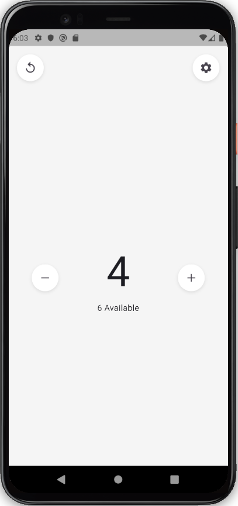

# Open Counter
Let's You Count Things



## Prerequisites
- Flutter SDK ([Flutter official site](https://flutter.dev/))
- Dart SDK (Comes with Flutter)
- IDE (choose what you like): 
    - [VS Code](https://code.visualstudio.com/)  
    - [Android Studio](https://developer.android.com/studio)

1. Clone the repo:
```bash
https://github.com/atomi19/open_counter.git
```

2. Navigate to the project directory:
```bash
cd open_counter
```

3. Get dependencies:
```bash
flutter pub get
```

4. Run the project on iOS, Android, or wherever you want
```
flutter run
```

## License
This project is licensed under the [MIT](LICENSE.txt) License